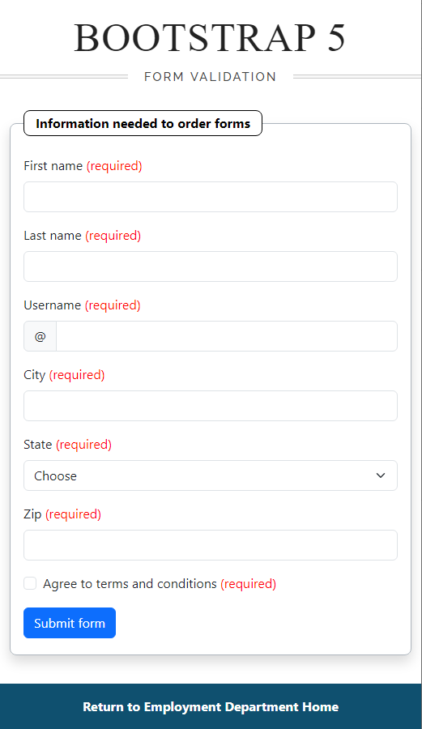

# About


Bootstrap 5 client side validation which will be called prior to server side validation.

Code came frm [Bootstrap 5 documentation](https://getbootstrap.com/docs/5.3/forms/validation/)


:small_orange_diamond: `console.log()` statements are for debugging purposes only.

## Required/accessibility

The following added required in English or Spanish.

- [Language codes](https://www.w3schools.com/tags/ref_language_codes.asp)
- [:lang()](https://developer.mozilla.org/en-US/docs/Web/CSS/:lang)

```css
:lang(en).required:after {
    content: " (required)";
    color: red;
}

:lang(sp).required:after {
    content: " (Requerido)";
    color: red;
}
```

### Usage

Add `required` class to the label.

```html
<label for="validationCustom01"
        class="form-label required">
    First name
</label>
```
---



