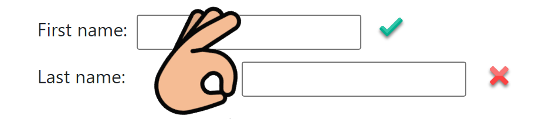

# About

This project focuses on [associating labels to inputs](https://www.w3.org/WAI/WCAG21/Techniques/html/H44).

## Styles

## Javascript

## Basic.html

- **Top set** uses no visible label, instead uses a hidden label to keep compliant. Without the hidden label there would be two errors indicating there are missing labels. The reasoning is there is no space for visible labels.
- **Middle set** is conventional, label on top of input and works best in responsive design. Also easy to get alignment correct. If instead, using the final set and have aria help to the right of the password input responsive design would take a hit in that without using multiple media queries the help text would fold under the password label rather than the password input.
- **Bottom set** is considered the old convention for obtaining input. A common mistake here is having labels and inputs with breathing space between the two which can be challenging as per the image below, some users can only see between the fingers. Also, this can be challenging for a developer to get alignment correct. In the code an extra effort was needed to get alignment correct regarding right aligning labels.

## Index.html
