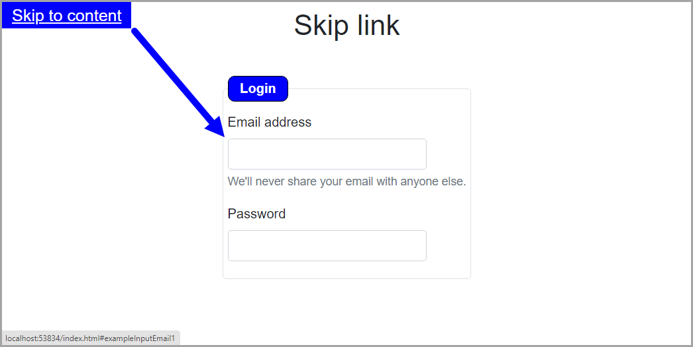

# What is a skip link?

It is just a link with a href that points to another area on the page via an ID reference. the most common place to find these would be at the top of a page, they'll seldom be visible until they receive keyboard focus, as they're often hidden away until they do receive focus, but sometimes you may encounter Skip Links that are always visible, both work, they achieve the same thing.

Amazon is a good site to try this.

